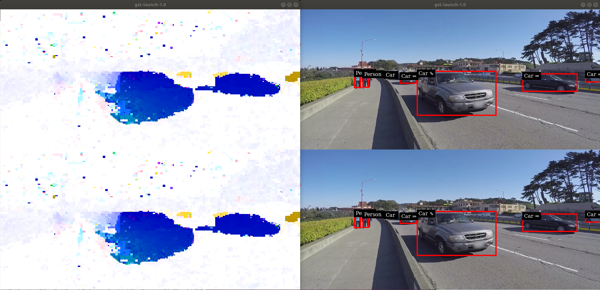
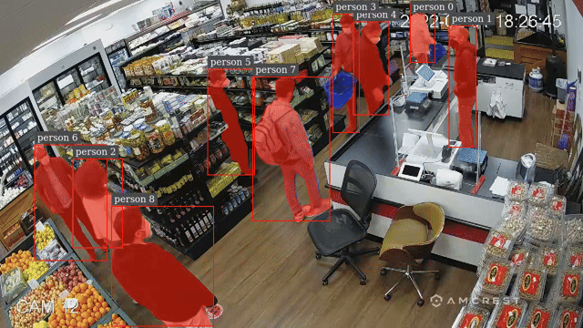
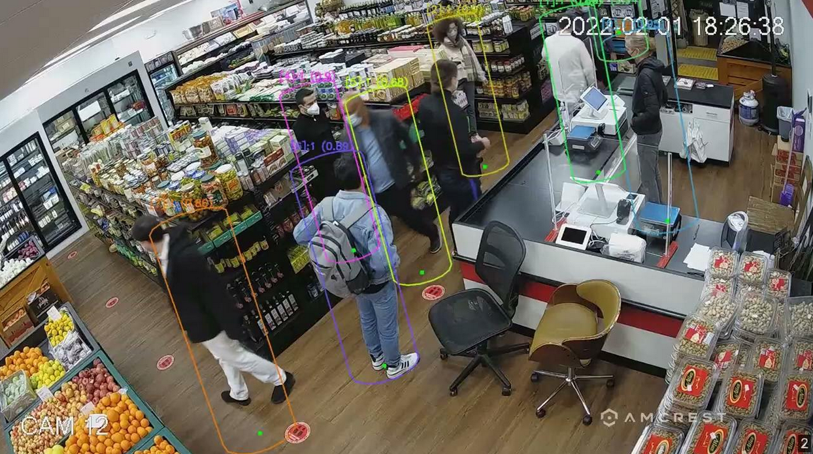
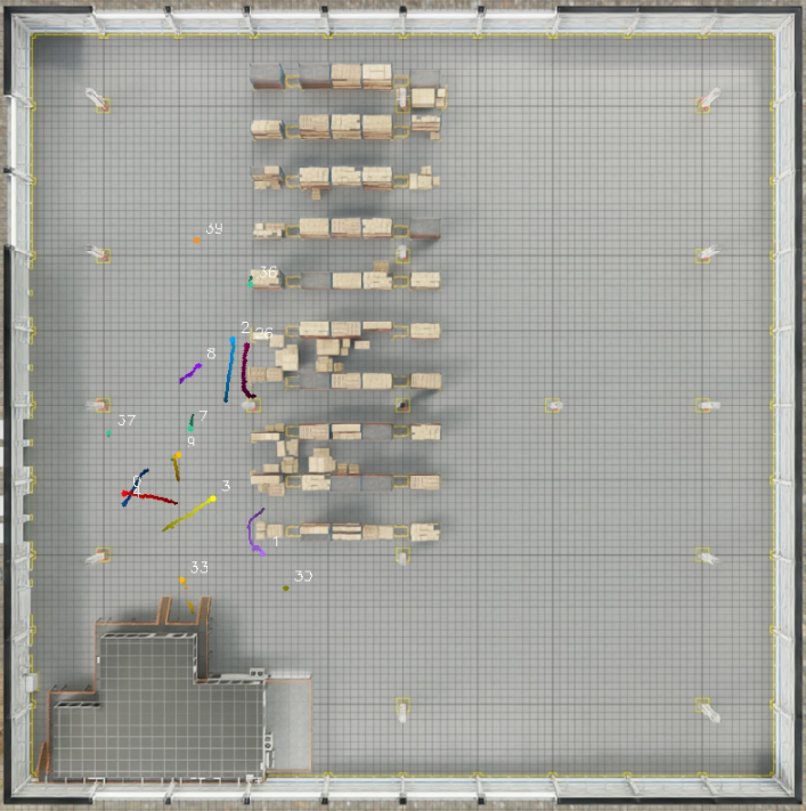
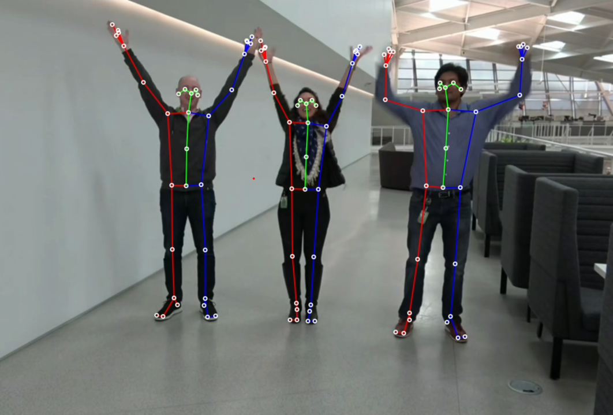

<!--
SPDX-FileCopyrightText: Copyright (c) 2026 NVIDIA CORPORATION & AFFILIATES. All rights reserved.
SPDX-License-Identifier: Apache-2.0

Licensed under the Apache License, Version 2.0 (the "License");
you may not use this file except in compliance with the License.
You may obtain a copy of the License at

http://www.apache.org/licenses/LICENSE-2.0

Unless required by applicable law or agreed to in writing, software
distributed under the License is distributed on an "AS IS" BASIS,
WITHOUT WARRANTIES OR CONDITIONS OF ANY KIND, either express or implied.
See the License for the specific language governing permissions and
limitations under the License.
-->

# Reference Apps using DeepStream 9.1

This repository contains the reference applications for video analytics tasks using TensorRT and DeepStream SDK 9.1.

## Getting Started ##
We currently provide different DeepStream reference applications:
All c/c++ reference apps are built and installed automatically by `bash build/build.sh`. See [build/BUILD.md](../../../build/BUILD.md) for full instructions.

For further details on each app, please see each project's README.

### Anomaly Detection : [README](anomaly/README.md) ###
  The project contains auxiliary dsdirection plugin to show the capability of DeepstreamSDK in anomaly detection.
  
### Runtime Source Addition Deletion: [README](runtime_source_add_delete/README.md) ###
  The project demonstrates addition and deletion of video sources in a live Deepstream pipeline.
### MaskTracker: [README](deepstream-masktracker/README.md) ###
  This sample app demonstrates DeepStream MaskTracker for multi-object tracking and segmentation using SAM2.
  
### Single-View 3D Tracking: [README](deepstream-tracker-3d/README.md) ###
  The sample app demonstrates single-view 3D tracking with DeepStream multi-object tracking to reconstruct 3D human model in world coordinates under occlusion.
  
### Multi-View 3D Tracking: [README](deepstream-tracker-3d-multi-view/README.md) ###
  The samples demonstrate multi-view 3D tracking in DeepStream, a distributed, real-time framework designed for large-scale, calibrated camera networks.

   
### Parallel Multiple Models Inferencing: [README](deepstream_parallel_inference_app/README.md) ###
  The project demonstrate how to implement multiple models inferencing in parallel with DeepStream APIs.
### Bodypose 3D Model Inferencing: [README](deepstream-bodypose-3d/README.md) ###
  The sample demonstrate how to customize the multiple input layers model preprocessing and the customization of the bodypose 3D model postprocessing.
  
### Video Buffers sharing between pipelines through IPC: [README](deepstream-ipc-test-sr/README.md) ###
  This sample demonstrates how to share video buffers over IPC and how to change output video buffers.
### Custom Video Tiling Config: [README](deepstream-custom-tile-config/README.md) ###
 This sample demonstrates the usage of "custom-tile-config" of nvmultistreamtiler to customize the tiling positions and sizes of multiple videos in batch.
### DeepStream VLLM Plugin: [README](deepstream-vllm-plugin/README.md) ###
 A GStreamer plugin for NVIDIA DeepStream that integrates Vision-Language Models (VLM) using VLLM for real-time video understanding and analysis.

## Pyservicemaker Sample apps: [README](pyservicemaker_sample_apps/README.md)
The apps in pyservicemaker_sample_apps are additional samples demonstrating usage of the Python API for DeepStream Service Maker, either by flow API or by pipeline API. See the [Python Service Maker documentation](https://docs.nvidia.com/metropolis/deepstream/dev-guide/text/DS_service_maker_python.html) for details.
