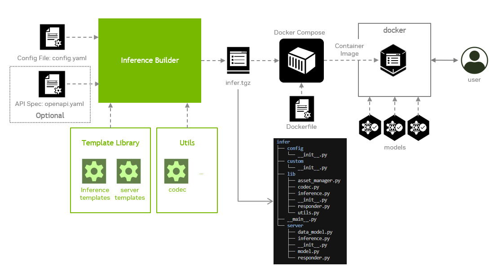
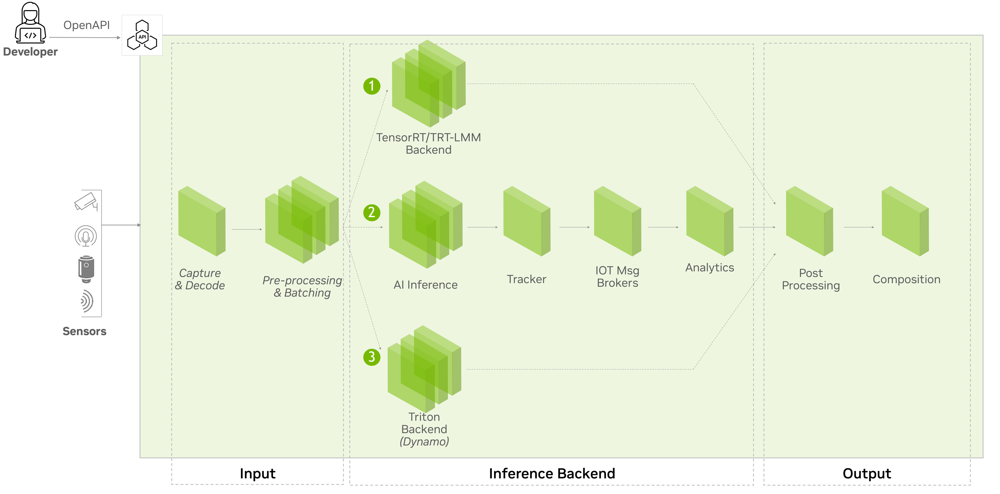
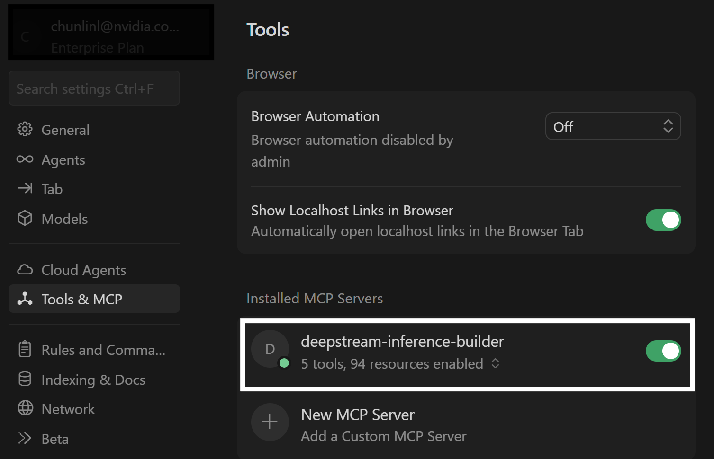

# Inference Builder

## Overview

Inference Builder is a tool that automatically generates inference pipelines and integrates them into either a microservice or a standalone application. It takes an inference configuration file and an OpenAPI specification (when integrated with an HTTP server) as inputs, and may also require custom code snippets in certain cases.

The output of the tool is a Python package that can be used to build a microservice container image with a customized Dockerfile.



The Inference Builder consists of three major components:

- Code templates: These are reusable modules for various inference backends and frameworks, as well as for API servers. They are optimized and tested, making them suitable for any model with specified inputs, outputs, and configuration parameters.
- Common inference flow: It serves as the core logic that standardizes the end-to-end inference process—including data loading and pre-processing, model inference, post-processing, and integration with the API server. It supports pluggable inference backends and frameworks, enabling flexibility and performance optimization.
- Command line tool: It generates a source code package by combining predefined code templates with the Common Inference Flow. It also automatically produces corresponding test cases and evaluation scripts to support validation and performance assessment.

Visit our [documentation](doc) for more details:

- [Inference Builder Usage](doc/usage.md)
- [Inference Builder Architecture](doc/architecture.md)

## Getting started

First, be sure your system meets the requirement.

| Operating System   | Python | CPU            | GPU[^1]                      |
|:-------------------|:-------|:---------------|:-----------------------------|
|Ubuntu 24.04        |3.12    | x86, aarch64   |Nvidia ADA, Hopper, Blackwell |

[^1]: If you only generate the inference pipeline without running it, no GPU is required.

Next, follow these steps to get started:

### Install prerequisites

```bash
sudo apt update
sudo apt install python3.12-venv python3.12-dev
```

Docker environment must be properly set up with below packages for building and running the examples:

- **Docker**: [Installation Guide](https://docs.docker.com/desktop/setup/install/linux/ubuntu/)
- **Docker Compose**: [Installation Guide](https://docs.docker.com/desktop/setup/install/linux/ubuntu/)
- **NVIDIA Container Toolkit**: [Installation Guide](https://docs.nvidia.com/datacenter/cloud-native/container-toolkit/latest/install-guide.html)

Ensure nvidia runtime added to `/etc/docker/daemon.json` to run GPU-enabled containers

```bash
{
    "runtimes": {
        "nvidia": {
            "args": [],
            "path": "nvidia-container-runtime"
        }
    }
}
```

The `docker` group must exist in your system, please check if it has been created using `getent group docker`. Your current user must belong to the `docker` group, If not, run the command below, then log out and back in for the group change to take effect.

```bash
sudo usermod -aG docker $USER
```

**Note for TEGRA users:** If you're using a TEGRA device, you'll also need to install the Docker buildx plugin:

```bash
sudo apt install docker-buildx
```

**Note for Jetson Orin users:** External storage integration is required to support the execution of the DeepStream microservice on the Jetson Orin platform.

Download and install the NGC CLI from the [NGC page](https://org.ngc.nvidia.com/setup/installers/cli) and follow the [NGC CLI Guide](https://docs.ngc.nvidia.com/cli/index.html) to set up the tool.

### Enter the component directory

```bash
cd <deepstream-repo>/tools/inference_builder
```

### Set up the virtual environment

```bash
python3 -m venv .venv
source .venv/bin/activate
pip3 install -r requirements.txt
```

## Play with the examples

Now you can try [our examples](builder/samples/README.md) to learn more. These examples span all supported backends and demonstrate their distinct inference flows.



## Benefit of using Inference Builder

Compared to manually crafting inference source code, Inference Builder offers developers the following advantages:
- Separation of concerns: Introduces a new programming paradigm that decouples inference data flow and server logic from the model implementation, allowing developers to focus solely on model behavior.
- Backend flexibility: Standardizes data flow across different inference backends, enabling developers to switch to the optimal backend for their specific requirement without rewriting the entire pipeline.
- Hardware acceleration: Automatically enables GPU-accelerated processing to boost performance.
- Streaming support: Provides built-in support for streaming protocols such as RTSP with minimal configuration.
- Standardized testing: Automates and standardizes test case generation to simplify validation and evaluation workflows.

## MCP Integration

Inference Builder includes MCP (Model Context Protocol) integration, enabling AI-assisted pipeline generation directly within Cursor or Claude Code. With MCP, you can use natural language to generate inference pipelines, build Docker images, and explore sample configurations.

For detailed tool reference and advanced usage, see [mcp/README-MCP.md](mcp/README-MCP.md).

### Prerequisites

Before setting up MCP, ensure you have completed the [Getting Started](#getting-started) steps above.

Ensure that you are in the Inference Builder component directory
(`tools/inference_builder/` from the DeepStream repository root).

### Start the MCP Server

Use the provided management script from the component directory:

```bash
# Start (runs in background)
MCP_API_KEY=MY_SECRET ./mcp/server_manager.sh start --port 8000

# Check status
./mcp/server_manager.sh status

# Tail logs
./mcp/server_manager.sh logs

# Stop
./mcp/server_manager.sh stop
```

Omit `MCP_API_KEY` to allow unauthenticated access. Use `--workspace-root` to set a custom directory for per-session workspaces.

### Connect to the MCP Server

#### Cursor

Add the following to `~/.cursor/mcp.json` (global) or `<project>/.cursor/mcp.json` (project-specific):

```json
{
  "mcpServers": {
    "deepstream-inference-builder": {
      "url": "http://<host>:8000/mcp",
      "headers": { "Authorization": "Bearer MY_SECRET" }
    }
  }
}
```

Then navigate to **File > Preferences > Cursor Settings > MCP**. A green status icon next to `deepstream-inference-builder` confirms the connection:



#### Codex

Run the following command to register the server:

```bash
# With MCP_API_KEY enabled on the server
export MCP_API_KEY=MY_SECRET
codex mcp add deepstream-inference-builder \
  --url http://<host>:8000/mcp \
  --bearer-token-env-var MCP_API_KEY

# Without MCP_API_KEY
codex mcp add deepstream-inference-builder \
  --url http://<host>:8000/mcp
```

Verify the connection is configured:

```bash
codex mcp list
```

#### Claude Code

Run the following command to register the server:

```bash
# User-level (available in all projects)
claude mcp add --transport http --scope user \
  deepstream-inference-builder http://<host>:8000/mcp \
  --header "Authorization: Bearer MY_SECRET"

# Project-level
claude mcp add --transport http --scope project \
  deepstream-inference-builder http://<host>:8000/mcp \
  --header "Authorization: Bearer MY_SECRET"
```
Omit `--header` if no API key was set on the server. Then verify the connection by running `/mcp` in the Claude Code console:

```
❯ deepstream-inference-builder · ✔ connected
```

### Start Using the MCP Tools

Invoke the tools by mentioning "deepstream inference builder" in your prompt:
- "Show me what sample configurations are available from the inference builder?"
- "Generate a DeepStream object detection pipeline using the inference builder with PeopleNet transformer model from NGC."

### Available MCP Tools

| Tool | Description |
|------|-------------|
| `generate_inference_pipeline` | Generate inference pipelines from YAML configuration files |
| `build_docker_image` | Build Docker images from generated pipelines |
| `docker_run_image` | Run Docker images for testing and troubleshooting |
| `prepare_model_repository` | Download models from NGC or HuggingFace and prepare repositories |
| `generate_nvinfer_config` | Generate DeepStream nvinfer runtime configuration files |

### Available MCP Resources

| Resource | Description |
|----------|-------------|
| `docs://README.md` | Project documentation |
| `docs://mcp/README-MCP.md` | MCP integration documentation |
| `schema://config.schema.json` | Configuration schema reference |
| `samples://config/*` | Sample pipeline configurations |
| `samples://dockerfile/*` | Sample Dockerfiles |
| `samples://processor/*` | Sample preprocessors and postprocessors |

### Sample Prompts

You can now try out the [example prompts](prompts.md) using either Cursor or Claude Code.

## Agent Skills Integration

This repository ships the Inference Builder skill at
[`skills/inference-builder/`](../../skills/inference-builder/). Claude Code discovers
it through the root `.claude/skills` link, and other compatible agents can copy that
directory into their user-level skills directory. The skill resolves the in-tree CLI
and schemas from the DeepStream repository root.

### Sample Prompts

You can now try out the [example prompts](prompts.md) using Claude Code.

## Development policy

Inference Builder follows the DeepStream repository's development and licensing policy.
The project is not accepting external code contributions; see the root
[`README.md`](../../README.md#contribution-guidelines) for details.


## Project status and roadmap

The project is under active development and the following features are expected to be supported in the near future:

- Support for more backends and frameworks such as SGLANG.
- Support for more model types such as speech models.
